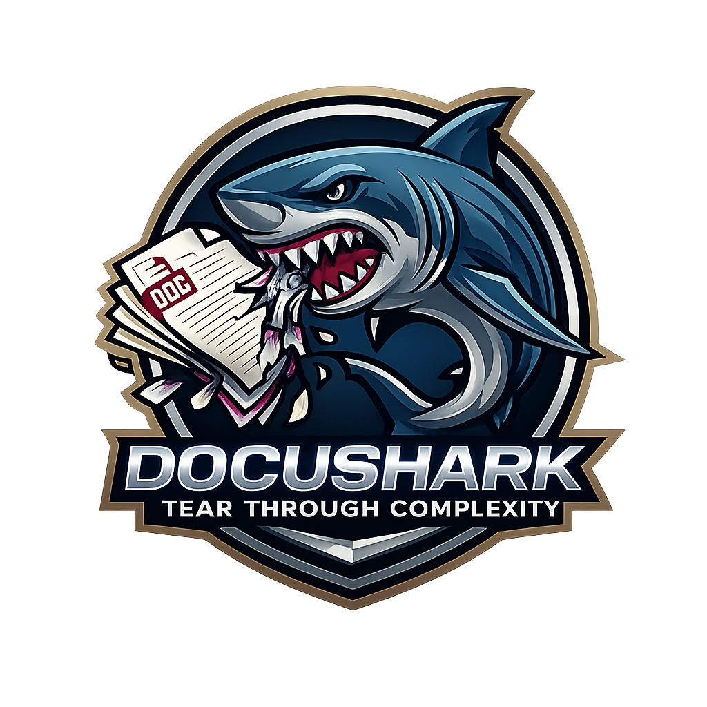

# DocuShark

[](LICENSE)
[](https://github.com/JPE-Net-Technologies/docushark/actions/workflows/docs.yml)
[](https://github.com/JPE-Net-Technologies/docushark/actions/workflows/release.yml)
[](https://github.com/JPE-Net-Technologies/docushark/releases)
[](https://github.com/JPE-Net-Technologies/docushark/releases)

DocuShark is a high-performance diagramming and whiteboard application that handles **10,000+ shapes at 60fps**. Built with TypeScript, React, and Canvas 2D API. Runs as a desktop app (Tauri) or in your browser.

**[Download the latest release](https://github.com/JPE-Net-Technologies/docushark/releases)**

<!--  -->

## ✨ Features

- **🚀 High Performance** – Canvas 2D rendering with spatial indexing (R-tree) for buttery-smooth editing
- **👥 Real-time Collaboration** – Work together via Protected Local mode with CRDT-based sync (Yjs)
- **📦 Rich Shape Libraries** – Flowchart, UML, ERD shapes built-in, plus custom shape libraries
- **📄 Multi-page Documents** – Organize complex projects across multiple pages
- **✏️ Rich Text Editor** – Add formatted documentation alongside your diagrams
- **💾 Offline-first** – Full offline support with automatic sync when reconnected
- **🖥️ Desktop & Web** – Native desktop app (Windows, macOS, Linux) or browser-based
- **📤 Export** – PNG, SVG, JSON export with clipboard support

## 📖 Documentation

**[View the full documentation →](https://JPE-Net-Technologies.github.io/docushark/)**

- [Getting Started](https://JPE-Net-Technologies.github.io/docushark/getting-started/introduction/)
- [Installation](https://JPE-Net-Technologies.github.io/docushark/getting-started/installation/)
- [Keyboard Shortcuts](https://JPE-Net-Technologies.github.io/docushark/guide/keyboard-shortcuts/)
- [Architecture](https://JPE-Net-Technologies.github.io/docushark/developer/architecture/)

## 🚀 Quick Start

```bash
# Install dependencies
bun install

# Start development server (web)
bun run dev

# Start desktop app development
bun run tauri:dev

# Run tests
bun run test

# Build for production
bun run build          # Web
bun run tauri:build    # Desktop
```

## 🏗️ Tech Stack

| Layer | Technology |
|-------|------------|
| Desktop | Tauri v2 (Rust backend) |
| Runtime | Bun |
| Language | TypeScript (strict), Rust |
| UI | React 18 |
| Canvas | Canvas 2D API |
| State | Zustand + Immer |
| Collaboration | Yjs CRDTs |
| Rich Text | Tiptap |
| Spatial Index | RBush |
| Build | Vite, Cargo |

## 📁 Project Structure

```
/src
├── /engine          # Core canvas engine (Camera, Renderer, Tools)
├── /shapes          # Shape types and registry
├── /store           # Zustand stores (Document, Session, History)
├── /collaboration   # Yjs sync, WebSocket protocol
├── /ui              # React components
├── /math            # Vector and matrix utilities
└── /utils           # General utilities
/src-tauri           # Rust backend (Tauri)
/relay               # Standalone collaboration / MCP / auth server
/docs-site           # Documentation (VitePress)
```

## 📄 License

MIT
