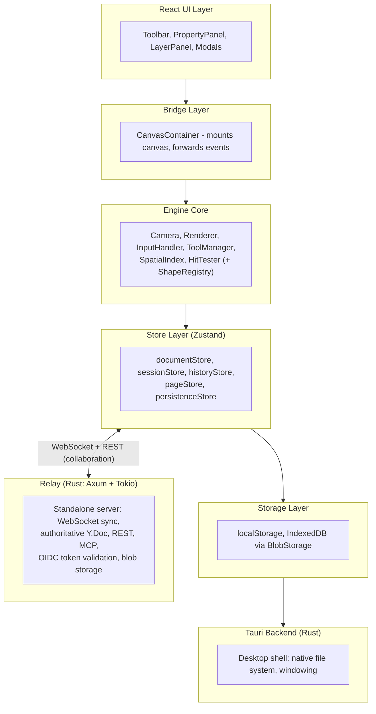

# How the Engine Fits Together

This page is an **orientation for building on DocuShark** — just enough of the
architecture to write a shape, a tool, a UI feature, or a client. It is not an
exhaustive internal reference; for the last word, read the source.

::: tip Extension surface vs. engine core
DocuShark is AGPL, so every line is readable — but "readable" and "a supported
extension surface" are different things. The parts we document here and want you
building on are the **edges**: custom **shapes**, **tools**, **UI features /
panels**, and **clients** on the public REST + MCP API. The **engine core** and
the **relay's CRDT/sync internals** are deliberately *not* documented as an
extension surface — they change without notice and aren't a supported contribution
path. Extend at the edges; build on the public API.
:::

## Technology Stack

| Layer | Technology |
|-------|------------|
| Runtime | Bun (package manager, JS runtime) |
| Desktop | Tauri v2 (Rust backend) |
| Language | TypeScript (strict), Rust |
| UI Framework | React 18+ |
| Canvas | Canvas 2D API (pure, no libraries) |
| State | Zustand + Immer |
| Collaboration | Yjs CRDTs over WebSocket |
| Rich Text | Tiptap (ProseMirror) |
| Spatial Index | RBush (R-tree) |
| Build | Vite (frontend), Cargo (Rust) |

## The Layers

- **React UI** renders only the chrome (toolbar, panels, modals) — never the
  canvas. `App.tsx`, `Toolbar.tsx`, `PropertyPanel.tsx`, `LayerPanel.tsx`, and the
  bridge `CanvasContainer.tsx`.
- **Engine core** is pure TypeScript with no React dependency: `Camera`,
  `Renderer`, `InputHandler`, `ToolManager`, `SpatialIndex`, `HitTester`, plus the
  `ShapeRegistry` (which lives under `src/shapes/`). The render loop is a
  `requestAnimationFrame` cycle — this is why large diagrams stay smooth.
- **Stores** are Zustand + Immer, split by responsibility (below).
- **Storage** is hybrid: `localStorage` for metadata/preferences, IndexedDB for
  binary blobs via `BlobStorage.ts` (content-addressed SHA-256, dedup, GC).
- **Tauri backend** (`src-tauri/`) is the desktop *shell* only — native file
  system + windowing. It is a pure client and **does not run the collaboration
  server**.
- **Relay** (`relay/`, Axum + Tokio) owns collaboration: the WebSocket sync
  channel, an authoritative server-side `Y.Doc` per active document, document +
  blob storage, REST, the MCP endpoint, and **OIDC token validation** (it verifies
  external JWTs against a JWKS — it never mints tokens). See
  [Wire Protocol & Building a Client](./collaboration-protocol).

## Shapes Are Data

Shapes are plain, JSON-serializable objects with **no methods**. All behaviour is
external, registered per shape type with the **ShapeRegistry**. A handler provides
five functions — `render`, `hitTest`, `getBounds`, `getHandles`, `create` (plus
optional `getLabelEditTarget` / `renderOverlay`):

- `render(ctx, shape)` — the canvas context is **already transformed to world
  space**, so you draw in world coordinates and never touch the camera here.
- `create(position, id)` — build a new shape instance at a point.

Every shape extends `BaseShape`: `id`, `type` (a `ShapeType`), `x`, `y`,
`fill` / `stroke` (`string | null` — `null` means "none"), `strokeWidth`,
`opacity`, `rotation`, `locked`, `visible`. Size and shape-specific fields live on
the concrete type (e.g. `width`/`height` on a rectangle, `radiusX`/`radiusY` on an
ellipse) — not on `BaseShape`. Full field reference:
[Shape Properties](./shape-properties). To author one:
[Creating Custom Shapes](./creating-shapes).

## The Coordinate System

The `Camera` class owns all coordinate math — never apply pan/zoom by hand.

- `camera.screenToWorld(point)` / `camera.worldToScreen(point)` convert between the
  canvas pixels an event carries and the infinite world plane your shapes live on.
- `camera.getVisibleBounds()` returns the visible world rectangle — used for
  viewport culling.
- The renderer composes `camera.getTransformMatrix()` onto the device-pixel
  (DPI) transform once per frame, then draws every shape in world space.

## Tools Are State Machines

A tool reacts to normalised pointer/keyboard events and holds its own interaction
state. It receives a **`ToolContext`** of granular accessor functions — not the
raw stores — to stay decoupled: `getShapes` / `getShapeOrder`, `addShape` /
`updateShape` / `deleteShapes`, `select`, `setCursor`, `setActiveTool`,
`pushHistory`, plus `camera`, `hitTester`, and `requestRender`. Register a tool
with `toolManager.register(new MyTool())`. To author one:
[Creating Custom Tools](./creating-tools).

## The Stores

Zustand + Immer; mutate only through Immer, never in place.

| Store | Responsibility |
|-------|----------------|
| `documentStore` | Shapes (connectors and groups are *shapes*) + their z-order (`shapeOrder`) — the single source of truth for content |
| `sessionStore` | Ephemeral UI state: `selectedIds` (a `Set`), `camera`, `hoveredId`, `activeTool`, `cursor` |
| `historyStore` | Undo/redo — `push(description?)` snapshots the document; `undo()` / `redo()` |
| `pageStore` | Multi-page structure and ordering |
| `persistenceStore` | Save/load, auto-save, localStorage |

Collaboration adds `relayDocumentStore` (workspace/relay-stored documents; cached
offline by `RelayDocumentCache`) and `userStore` (identity + JWT). Feature stores
(theme, style profiles, palettes, settings, …) each live in their own file under
`src/store/`.

## Extension Points

| Extension | Mechanism | Guide |
|-----------|-----------|-------|
| Custom shapes | Register handlers with `ShapeRegistry` | [Creating Custom Shapes](./creating-shapes) |
| Custom tools | Register with `ToolManager` | [Creating Custom Tools](./creating-tools) |
| UI features / panels | The `PanelExtensions.ts` registry | [Building UI Features](./plugin-development) |
| Shape libraries | Collections under `src/shapes/library/` | [Creating Custom Shapes](./creating-shapes) |
| Export formats | Add exporters in `exportUtils.ts` | [Utility Modules](./utilities) |
| PDF node types | Register with `PDFNodeRendererRegistry` in `pdfExportUtils.ts` | [Creating Prose Helpers](./creating-prose-helpers) |
| Prose (Tiptap) helpers | Shared extensions in `TiptapEditor.tsx` | [Creating Prose Helpers](./creating-prose-helpers) |

## Next Steps

- **Extend:** [Creating Custom Shapes](./creating-shapes) ·
  [Creating Custom Tools](./creating-tools) ·
  [Building UI Features](./plugin-development)
- **Integrate:** [REST API](./rest-api) · [MCP Tools](./mcp-tools) ·
  [Wire Protocol & Building a Client](./collaboration-protocol)
- **Set up:** [Project Setup](./project-setup) · [Contributing](./contributing)
