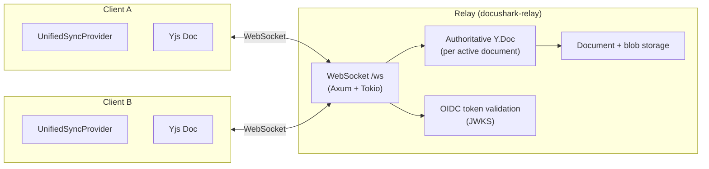
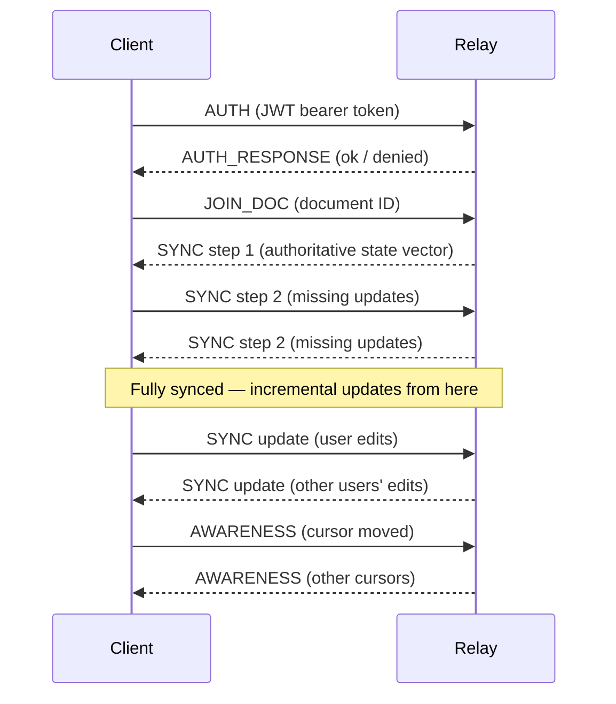

# Collaboration Protocol

DocuShark's real-time collaboration runs through a **standalone relay**
(`docushark-relay`) — a server that clients connect to over a WebSocket. The relay
holds the authoritative copy of each active document and broadcasts changes to
every connected client. All document sync uses **Yjs CRDTs** for conflict-free
merging.

The desktop app is a pure client: local documents stay on the user's machine, and
anything collaborative goes through a relay.

## Architecture Overview



### UnifiedSyncProvider

On the client, `UnifiedSyncProvider` (`/src/collaboration/`) drives the WebSocket
channel, which carries:

1. **CRDT sync** — Yjs document updates
2. **Awareness** — cursor positions, selections, presence
3. **Authentication** — a bearer token validated by the relay

Document CRUD (list / get / save / delete) is **not** on the WebSocket — it's
served by the relay's REST API (`/api/docs/*`, `/api/blobs/*`). The WebSocket is
dedicated to live editing.

## Wire Protocol

Messages are binary (`ArrayBuffer`). The first byte is the message-type tag.

::: warning
The TypeScript protocol (`/src/collaboration/protocol.ts`) and the Rust protocol
(`relay/src/server/protocol.rs`) must stay in sync. A mismatch causes silent data
corruption or dropped connections. Both pin `PROTOCOL_VERSION = 4`; wire-protocol
changes bump it on both sides with matching fixtures.
:::

### Message Types

| Tag | Name | Direction | Purpose |
|-----|------|-----------|---------|
| `0` | SYNC | Bidirectional | Yjs sync messages (step 1, step 2, update) |
| `1` | AWARENESS | Bidirectional | Cursor positions, selections, presence |
| `2` | AUTH | Client → Server | Bearer token (JWT) for validation |
| `7` | DOC_EVENT | Server → Client | Document created/updated/deleted notification |
| `8` | ERROR | Server → Client | Protocol or authorization error |
| `9` | AUTH_RESPONSE | Server → Client | Result of an AUTH request |
| `10` | JOIN_DOC | Client → Server | Join a document's CRDT room |
| `14` | SYNC_CHUNK | Client → Server | A fragment of a large SYNC frame |
| `15` | SYNC_CHUNK_ACK | Server → Client | Acknowledges a received chunk |
| `16` | HEARTBEAT | Bidirectional | Liveness heartbeat (additive, feature-detected — no `PROTOCOL_VERSION` bump) |

::: tip
Tags `3–6` (formerly `DOC_LIST` / `GET` / `SAVE` / `DELETE`) and `11–13` (formerly
`AUTH_LOGIN` / `DOC_SHARE` / `DOC_TRANSFER`) are **reserved** — those operations
moved to the REST API. The gaps are kept so old and new builds don't reuse a tag
with a new meaning.
:::

### Sync Flow



A very large initial update (for example, replaying a long offline session) can
exceed the per-message size limit. The client splits such a frame into
`SYNC_CHUNK` messages that the relay reassembles into the original
`[SYNC | update]` frame.

## Authoritative Relay Y.Doc

The relay keeps an **authoritative server-side `Y.Doc`** (via the `yrs` crate) for
each active document, in `relay/src/sync/`:

- On `JOIN_DOC`, the relay hydrates the document's active page from its stored JSON
  snapshot and answers the joining client's `SyncStep1` with authoritative state.
- Inbound `SYNC` frames are applied to the relay's Y.Doc and rebroadcast to peers.

This makes the relay the source of truth (rather than a whole-document
last-write-wins between clients). It's a **behavior** change only — the wire frames
are unchanged `lib0`-v1 sync bodies, so `PROTOCOL_VERSION` does not move. The relay
Y.Doc's shared types (`shapes` map, `shapeOrder` array, `metadata` map) mirror
`src/collaboration/YjsDocument.ts`.

### Snapshot Persistence

The relay flattens each dirty Y.Doc back to its JSON snapshot on a configurable
interval, on last-client eviction, and on graceful shutdown. Durability no longer
depends on a client issuing a REST save. The flatten targets the page the document
was hydrated from (its active page).

## Yjs Integration

[Yjs](https://yjs.dev) provides the CRDT data structures behind conflict-free
merging. DocuShark maps its document model onto Yjs types:

- **Y.Map** for shape properties and metadata
- **Y.Array** for shape ordering and collections
- Updates are compact binary diffs, not full snapshots

When a user edits, the change is applied to the local Yjs document, the binary
update is sent to the relay, and the relay applies it to the authoritative Y.Doc
and broadcasts it. Each client applies inbound updates to its local Yjs document,
and the Zustand stores update from there.

## Authentication

The relay is an **OIDC resource server**. It does not sign tokens or store
passwords — it **validates** RS256 JWTs:

1. The client obtains a token out-of-band from a trusted OIDC issuer.
2. The client sends it over the WebSocket as an `AUTH` message.
3. The relay validates the token against the issuer's JWKS (cached, with periodic
   refresh) and reads the workspace from the token's `wsp[]` claim.
4. `AUTH_RESPONSE` reports success or failure; authorized sessions proceed to
   `JOIN_DOC`.

Rotating signing keys at the issuer is picked up automatically within the JWKS
cache window — no relay restart required.

## Offline Support

DocuShark is offline-first. Collaboration features degrade gracefully when the
network is unavailable.

### OfflineQueue

When the WebSocket is disconnected, save and delete operations are queued rather
than dropped:

```
User edits document → OfflineQueue stores the operation →
  Network reconnects → Queue processes in order → Relay receives the updates
```

### SyncStateManager

Coordinates the offline queue, the storage layer, and the connection state, with
automatic retry and exponential backoff.

### SyncQueueStorage

Persists the offline queue to **IndexedDB** so queued operations survive app
restarts. On launch, pending operations are processed once a connection is
established.

## Relay Implementation (Rust)

The collaboration server lives in the standalone relay (`relay/src/`):

| Path | Purpose |
|------|---------|
| `server/mod.rs` | Server startup, Axum router, WebSocket upgrade |
| `server/protocol.rs` | Message-type definitions (must match TypeScript) |
| `server/documents.rs` | REST document CRUD |
| `server/permissions.rs` | Workspace/role authorization |
| `sync/` | Authoritative Y.Doc hydration, broadcast, and snapshot flattening |

The relay uses **Axum** for HTTP/WebSocket handling and **Tokio** for async I/O.
For deploying and configuring a relay, see its
[README](https://github.com/JPE-Net-Technologies/docushark/blob/master/relay/README.md).
