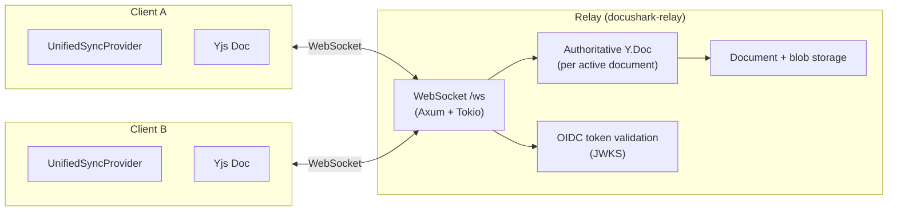
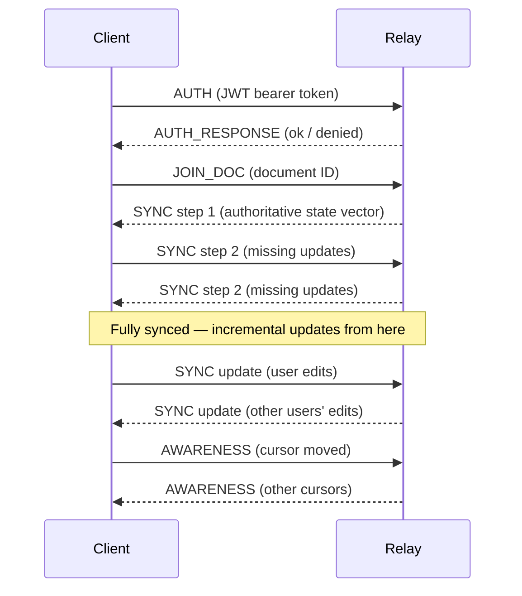

# Wire Protocol & Building a Client

Everything the editor does over the network is a public, documented contract, so
you can **build your own client** — an alternate editor, an offline companion, or
an integration. A client speaks two channels to the **standalone relay**
(`docushark-relay`): **Yjs CRDT sync + awareness + auth over a WebSocket**, and
**document CRUD over REST** (`/api/docs/*`, `/api/blobs/*`). The relay holds the
authoritative copy of each active document, merges every client's edits
conflict-free, and broadcasts the result.

You don't have to reimplement the merge: sync frames are standard `lib0`-v1 Yjs
sync bodies, so any Yjs client can speak them. The reference client is the editor's
own `UnifiedSyncProvider`.

## Architecture Overview


```mermaid
flowchart LR
  subgraph relay["Relay (docushark-relay)"]
    WS["WebSocket /ws\n(Axum + Tokio)"]
    YDOC["Authoritative Y.Doc\n(per active document)"]
    AUTH["OIDC token validation\n(JWKS)"]
    STORE["Document + blob storage"]
  end

  subgraph client1["Client A"]
    USP1["UnifiedSyncProvider"]
    YJS1["Yjs Doc"]
  end

  subgraph client2["Client B"]
    USP2["UnifiedSyncProvider"]
    YJS2["Yjs Doc"]
  end

  client1 <-->|WebSocket| WS
  client2 <-->|WebSocket| WS
  WS --> YDOC
  WS --> AUTH
  YDOC --> STORE
```

### UnifiedSyncProvider

On the client, `UnifiedSyncProvider` (`/src/collaboration/`) drives the WebSocket
channel, which carries:

1. **CRDT sync** — Yjs document updates
2. **Awareness** — cursor positions, selections, presence
3. **Authentication** — a bearer token validated by the relay

Document CRUD (list / get / save / delete) is **not** on the WebSocket — it's
served by the relay's REST API (`/api/docs/*`, `/api/blobs/*`). The WebSocket is
dedicated to live editing.

## Wire Protocol

Messages are binary (`ArrayBuffer`). The first byte is the message-type tag.

::: warning
The TypeScript protocol (`/src/collaboration/protocol.ts`) and the Rust protocol
(`relay/src/server/protocol.rs`) must stay in sync. A mismatch causes silent data
corruption or dropped connections. Both pin `PROTOCOL_VERSION = 4`; wire-protocol
changes bump it on both sides with matching fixtures.
:::

### Message Types

| Tag | Name | Direction | Purpose |
|-----|------|-----------|---------|
| `0` | SYNC | Bidirectional | Yjs sync messages (step 1, step 2, update) |
| `1` | AWARENESS | Bidirectional | Cursor positions, selections, presence |
| `2` | AUTH | Client → Server | Bearer token (JWT) for validation |
| `7` | DOC_EVENT | Server → Client | Document created/updated/deleted notification |
| `8` | ERROR | Server → Client | Protocol or authorization error |
| `9` | AUTH_RESPONSE | Server → Client | Result of an AUTH request |
| `10` | JOIN_DOC | Client → Server | Join a document's CRDT room |
| `14` | SYNC_CHUNK | Client → Server | A fragment of a large SYNC frame |
| `15` | SYNC_CHUNK_ACK | Server → Client | Acknowledges a received chunk |
| `16` | HEARTBEAT | Bidirectional | Liveness heartbeat (additive, feature-detected — no `PROTOCOL_VERSION` bump) |

::: tip
Tags `3–6` (formerly `DOC_LIST` / `GET` / `SAVE` / `DELETE`) and `11–13` (formerly
`AUTH_LOGIN` / `DOC_SHARE` / `DOC_TRANSFER`) are **reserved** — those operations
moved to the REST API. The gaps are kept so old and new builds don't reuse a tag
with a new meaning.
:::

### Sync Flow


```mermaid
sequenceDiagram
  participant C as Client
  participant S as Relay

  C->>S: AUTH (JWT bearer token)
  S-->>C: AUTH_RESPONSE (ok / denied)
  C->>S: JOIN_DOC (document ID)
  S-->>C: SYNC step 1 (authoritative state vector)
  C->>S: SYNC step 2 (missing updates)
  S-->>C: SYNC step 2 (missing updates)
  Note over C,S: Fully synced — incremental updates from here
  C->>S: SYNC update (user edits)
  S-->>C: SYNC update (other users' edits)
  C->>S: AWARENESS (cursor moved)
  S-->>C: AWARENESS (other cursors)
```

A very large initial update (for example, replaying a long offline session) can
exceed the per-message size limit. The client splits such a frame into
`SYNC_CHUNK` messages that the relay reassembles into the original
`[SYNC | update]` frame.

## The relay is authoritative

The relay holds the authoritative document and merges every client's inbound
`SYNC` frames into it before rebroadcasting — so conflicts resolve by CRDT merge,
not last-write-wins, and a late-joining client gets correct state from its
`SyncStep1` reply. It also persists on its own (periodically and when the last
client leaves), so durability never depends on a particular client issuing a save.

From a client's side this is transparent: **send your updates, apply the ones you
receive, and let the relay be the source of truth.** The server-internal
persistence mechanics live in the OSS relay source, not this client contract.

## Yjs Integration

[Yjs](https://yjs.dev) provides the CRDT data structures behind conflict-free
merging. DocuShark maps its document model onto Yjs types:

- **Y.Map** for shape properties and metadata
- **Y.Array** for shape ordering and collections
- Updates are compact binary diffs, not full snapshots

When a user edits, the change is applied to the local Yjs document, the binary
update is sent to the relay, and the relay applies it to the authoritative Y.Doc
and broadcasts it. Each client applies inbound updates to its local Yjs document,
and the Zustand stores update from there.

## Authentication

The relay is an **OIDC resource server**. It does not sign tokens or store
passwords — it **validates** RS256 JWTs:

1. The client obtains a token out-of-band from a trusted OIDC issuer.
2. The client sends it over the WebSocket as an `AUTH` message.
3. The relay validates the token against the issuer's JWKS (cached, with periodic
   refresh) and reads the workspace from the token's `wsp[]` claim.
4. `AUTH_RESPONSE` reports success or failure; authorized sessions proceed to
   `JOIN_DOC`.

Rotating signing keys at the issuer is picked up automatically within the JWKS
cache window — no relay restart required.

## Offline Support

DocuShark is offline-first. Collaboration features degrade gracefully when the
network is unavailable.

### OfflineQueue

When the WebSocket is disconnected, save and delete operations are queued rather
than dropped:

```
User edits document → OfflineQueue stores the operation →
  Network reconnects → Queue processes in order → Relay receives the updates
```

### SyncStateManager

Coordinates the offline queue, the storage layer, and the connection state, with
automatic retry and exponential backoff.

### SyncQueueStorage

Persists the offline queue to **IndexedDB** so queued operations survive app
restarts. On launch, pending operations are processed once a connection is
established.

## The relay source

The relay is an OSS Rust crate (`relay/`, Axum + Tokio) — its message-type
definitions in `relay/src/server/protocol.rs` are the authority the TypeScript
`protocol.ts` must match. If you want the *server* internals rather than this
client contract — the authoritative Y.Doc, persistence, storage, REST routes —
read the crate directly, or see [Self-Hosting](./self-hosting) to run one.
