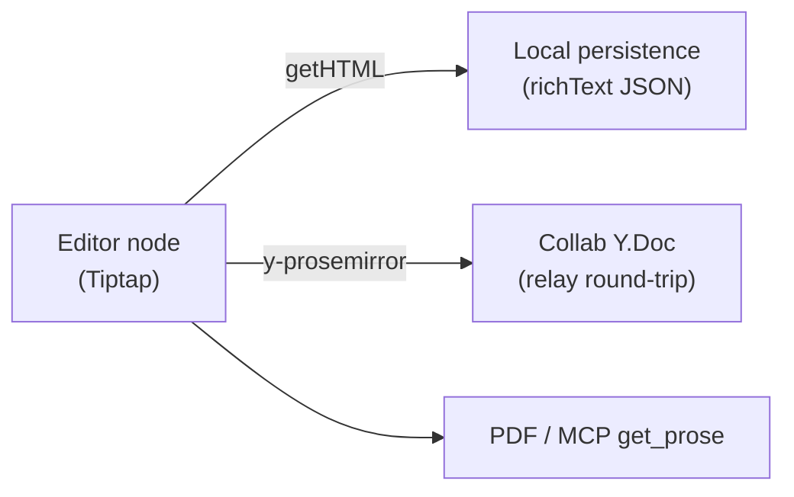

# Creating Prose Helpers

A **prose helper** is a custom Tiptap/ProseMirror node that lives in the written
body (not the canvas) and renders something richer than text — a **citation**, a
**bibliography**, **math**, a **callout**, a **footnote**, an embed. Citations
were the first; this guide is the paved path for the next one.

The hard part isn't the Tiptap node — it's making it survive everywhere a
document goes:

Each arrow broke at least once while citations were built. The kit below is what
makes them not break for the next helper.

## The prose-helper kit

| Layer | What it gives you | Where |
|---|---|---|
| **Serialization discipline** | A self-describing node that survives reload in WebKitGTK/Tauri (jsdom tests alone miss this) | the rules below + `src/tiptap/CitationExtension.ts` as the worked example |
| **Projection foundation** | Derived/async-rendered content that doesn't corrupt local persistence | `src/tiptap/proseProjection.ts` |
| **Relay round-trip** | The node survives the collaborative Y.Doc (HTML → Y.Doc → HTML) | `relay/src/sync/prose_schema.rs` (`CUSTOM_PROSE_NODES`), `prose_parse.rs`, `prose_html.rs`, `hydration.rs` |
| **Export** | Renders in PDF + MCP `get_prose` | `src/utils/pdfExportUtils.ts` |

## Pick your category first

This decides the effort:

- **Self-contained** (math, callouts, footnotes, embeds) — *all* the helper's
  data lives in its own node attributes/content. → You need only the four layers
  above. This is the common case and is cheap.
- **Data-backed** (citations point at a shared reference *library*) — the node
  references out-of-band document data. → You **also** need a **Y.Doc shared
  type** for that data, or it won't sync in collab and concurrent edits will
  clobber. See [Data-backed helpers](#data-backed-helpers). Most helpers are
  *not* this.

---

## Building a self-contained helper

### 1. Define the node (serialization rules)

Custom prose nodes must serialize **robustly** or they vanish on reload in
WebKit/Tauri (they survive jsdom, so unit tests alone won't catch it). The rules,
learned the hard way:

1. **Store state in `data-*` attributes**, each with its own `parseHTML` /
   `renderHTML` in `addAttributes` — no bare auto-rendered attrs.
2. **Never name an attribute `content`** — it's a reserved ProseMirror schema
   keyword.
3. **Array-form `renderHTML`** (`['span', {...}]`), never a
   `document.createElement` DOM node (fragile across serializers).
4. **Childless atoms** (`atom: true`) — don't nest block children in a leaf's
   DOM; cache any rendered HTML in a `data-*` attr instead.
5. **Normalize newlines out of attribute values.**

Register the node in `sharedProseExtensions` (`src/ui/TiptapEditor.tsx`) so both
the standalone and collaborative editors load it.

A permanent `getHTML → setContent` round-trip test guards all of the above —
copy the citation node's test.

### 2. Projection (only if the rendered content is derived)

If your node renders something computed asynchronously (a formatted citation, a
KaTeX render), it caches that output back into a `data-*` attr so static
consumers (PDF/MCP/offline) show it. **That write-back is NOT a user edit** —
treat it as a projection or it drives autosave and corrupts local persistence
(the slice-5.5 bug).

Use `src/tiptap/proseProjection.ts`:

- Tag the write-back transaction: `tr.setMeta(PROSE_PROJECTION_META, true)` (plus
  `tr.setMeta('addToHistory', false)`).
- In the editor's `onUpdate`, route projection transactions through
  `richTextStore.setContentSilently` (a non-dirtying mirror) instead of
  `setContent`. **Do not** wrap the write-back in `withAutoSaveSuppressed` — that
  latches `isDirty` and swallows the *next* real edit's autosave.
- Bail the write-back if `isAutoSaveSuppressed()` (no dispatch during
  load/new/switch).

::: tip Deriving from *other* prose
If the node's render depends on the rest of the document — the cited-only
bibliography lists only the references whose `citationInline` nodes are present
— subscribe to the editor's `update` event in the nodeView and **gate the
re-render on a cheap derived key** (e.g. the sorted set of cited ids). The gate
matters: your own projection write-back fires `update` too, so re-rendering
unconditionally loops. Recompute the key, compare, and only re-render on a real
change.
:::

### 3. Relay round-trip (so it survives collab)

The relay's HTML↔Y.Doc prose pipeline only knows a fixed node set; an unknown
node is **dropped** (inline → unwrapped to text; block → unwrapped to children).
`` is the precedent for a void-with-attrs node that survives. Mirror it:

1. **`relay/src/sync/prose_schema.rs`** — add a row to `CUSTOM_PROSE_NODES`:
   `(pm_type, html_tag, marker_data_attr)`. This is the single source of truth
   for the three coordinates; the parser uses `custom_node_pm()` to detect it.
2. **`prose_parse.rs`** (HTML → PM) — recognize your `tag[data-marker]` before
   the unknown-node fallback and emit a `PmNode` with the PM attr names (camelCase
   — they must match the editor node's `addAttributes` keys, *not* the `data-*`
   names). Inline nodes go in `collect_inline`; block nodes in `map_block_element`.
3. **`prose_html.rs`** (PM → HTML) — add a `block_for` arm returning
   `Block::Void(your_html(el, txn))`; write attrs in a **fixed order**, escaped
   with `escape_attr`. Model it on `citation_html` / `image_html`.
4. **`hydration.rs`** — add your node type to `block_has_substance` so a block
   that's childless-but-meaningful (or a paragraph containing only your inline
   atom) seeds instead of being mistaken for the empty-page placeholder.

::: warning A new node attribute needs the relay round-trip to be durable in collab
A custom attribute (beyond the ones already wired) survives local docs via
`getHTML`/JSON and live collab via peer Y.Xml attribute sync — but the relay's
HTML↔Y.Doc pipeline **drops attrs it doesn't serialize**, so a relay
cold-rehydrate (eviction + rejoin, or a restart) resets the attr to its node
default. Add it to `prose_html` + `prose_parse` (the steps above) to make it
fully durable. A *view preference* whose default is the safe direction — the
bibliography's `scope` resets to cited-only, which never hides a cited reference
and loses no library data — can ship best-effort without the relay change; real
content must round-trip.
:::

No `PROTOCOL_VERSION` bump and no document migration — this is purely additive
(the frames stay lib0-v1 sync; an older client just doesn't round-trip the new
node). Add a full **HTML → `html_to_blocks` → `build_prose_node` →
`fragment_to_html`** round-trip test — that's the regression that proves it
survives the collaborative pipeline, not just jsdom.

::: tip
The parse/serialize handlers are explicit per node today (the two citation nodes
differ in shape: inline-atom-with-text-child vs childless block). When a third or
fourth node makes them feel repetitive, data-drive them off `CUSTOM_PROSE_NODES`
— it's a clean, low-risk refactor. `mathInline`/`mathBlock` is the named next
entry.
:::

### 4. Export

Register a renderer in `src/utils/pdfExportUtils.ts` (`pdfNodeRenderers.register`
+ handle the node in `extractSegments`) so the node appears in PDF export and is
carried through MCP `get_prose`.

---

## Data-backed helpers

If your node references **document-level data outside the node** (as a citation
references the shared reference *library*), that data must become a **Y.Doc
shared type** too — otherwise it won't sync in collaboration and concurrent edits
will clobber it a whole field at a time. The reference library is the worked
example (`references` `Y.Map` + `referenceOrder` `Y.Array`):

- **Relay** owns it: seed on hydrate (`hydration.rs`, idempotent + run on the
  binary-sidecar backstop path too), re-assert on flatten (`flatten.rs`), and let
  MCP writes hit the live Y.Doc when resident.
- **Client** binds it: `src/collaboration/YjsDocument.ts` (shared-type accessors
  + a coarse change observer) ↔ the feature store, wired in
  `useCollaborationSync.ts` (remote → bulk-reload under
  `runWithProvenance('remote-apply')`; local → per-item writes, provenance-gated).

Two invariants make concurrent edits safe:

- **Writes are strictly per-item** (`map.set`/`delete` by id) — never a whole-map
  rewrite from a store snapshot (that wipes a concurrent writer's not-yet-seen
  entry).
- **Reads bulk-reload the *merged* map** — so the store (and any autosave) always
  reflects every writer.

## The hard rules (don't relearn these)

- **A projection write-back is not a user edit.** Tag it; mirror it silently.
  (Local-persistence corruption otherwise.)
- **Serialize robustly** — `data-*` atoms, array `renderHTML`, childless, no
  reserved attr names. (WebKit reload-vanish otherwise.)
- **Round-trip through the relay** — unknown nodes are dropped on the collab
  Y.Doc path. (Citations/bibliography degraded to plain text until this landed.)
- **Out-of-band data needs a shared type.** (No live sync + concurrent-add
  clobber otherwise.)

## Checklist

- [ ] Tiptap node, registered in `sharedProseExtensions`, follows the 5
      serialization rules
- [ ] `getHTML → setContent` round-trip test
- [ ] (if derived) projection write-back via `PROSE_PROJECTION_META` +
      `setContentSilently`
- [ ] `CUSTOM_PROSE_NODES` row + `prose_parse` arm + `prose_html` arm +
      `block_has_substance` entry
- [ ] Relay HTML → Y.Doc → HTML round-trip test
- [ ] PDF/`get_prose` renderer
- [ ] (data-backed only) Y.Doc shared type + binding + the two invariants +
      a concurrency test
